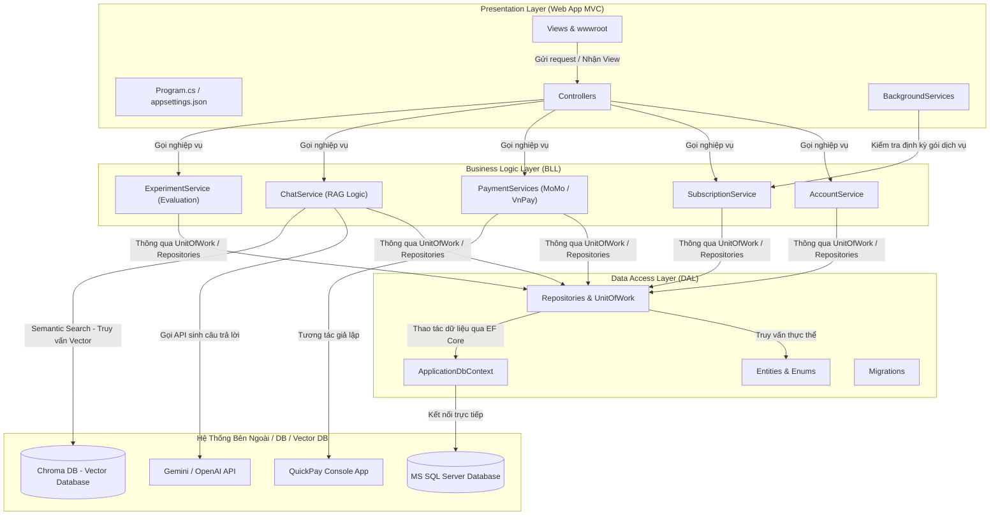
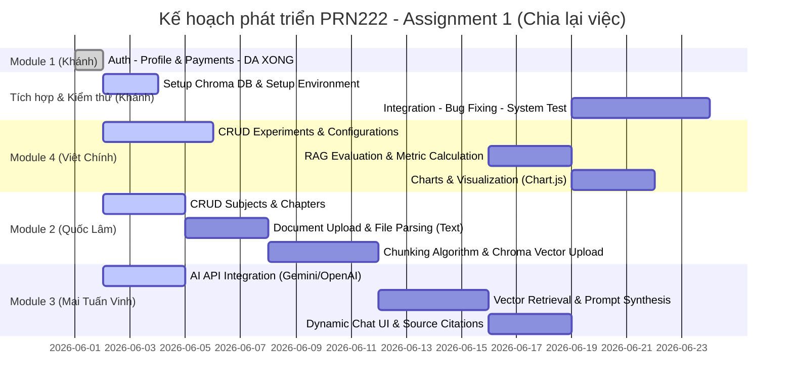
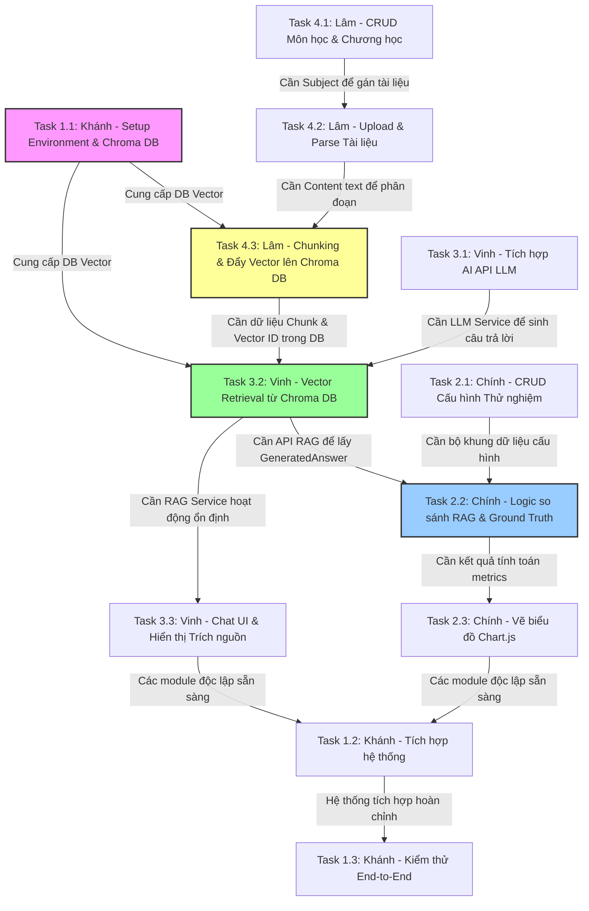

# Kiến Trúc Dự Án & Kế Hoạch Phân Công Công Việc

Tài liệu này bao gồm sơ đồ cấu trúc hệ thống và kế hoạch phân công công việc chi tiết cho nhóm 4 thành viên thuộc dự án **PRN222 Assignment 1** sau khi cập nhật **Khánh (Bạn)** làm **Trưởng nhóm** và đã hoàn thành xong **Module 1**.

---

## 1. Sơ Đồ Cấu Trúc Hệ Thống (Architecture Diagram)

Dự án được xây dựng theo mô hình **3-Layer Architecture** kết hợp với một ứng dụng Console độc lập mô phỏng Cổng thanh toán (**QuickPay**) và hệ cơ sở dữ liệu vector **Chroma DB** phục vụ tìm kiếm ngữ nghĩa (Semantic Search).

### Vai Trò Của Các Thành Phần Lưu Trữ Dữ Liệu
1.  **MS SQL Server Database:** Lưu trữ dữ liệu quan hệ (User, Role, Môn học, Tài liệu, Phiên Chat, Lịch sử tin nhắn, Cấu hình thử nghiệm).
    *   Đối với tài liệu đã được cắt nhỏ (Chunks), SQL Server lưu trữ metadata (Nội dung text, vị trí chunk, ID tài liệu gốc) và một cột `EmbeddingId` làm khóa ngoài liên kết sang **Chroma DB**.
2.  **Chroma DB (Vector Database):**
    *   Lưu trữ các vector biểu diễn ngữ nghĩa (Embeddings) của các đoạn văn bản (Document Chunks).
    *   Hỗ trợ thực hiện tìm kiếm tương đồng vector (Vector Similarity Search) theo cơ chế cosine similarity để lấy ra các đoạn văn bản có nội dung sát nhất với câu hỏi của người dùng.

---

## 2. Kế Hoạch Phân Công Công Việc (Task Assignment)

Dưới đây là kế hoạch phân chia công việc sau khi **Khánh (Bạn)** đã hoàn thành **Module 1** và chuyển sang vai trò **Tích hợp & Kiểm thử**. Các Module còn lại được bàn giao cho 3 thành viên khác.

---

## 3. Bản Đồ Sự Phụ Thuộc Lẫn Nhau Giữa Các Task (Task Dependencies)

Để dự án không bị tắc nghẽn, các thành viên cần lưu ý **mối liên hệ chặt chẽ** giữa các task. Dưới đây là sơ đồ luồng phụ thuộc:

### Các Nút Thắt (Bottlenecks) Cực Kỳ Quan Trọng:
1.  **Môi trường Chroma DB (Khánh - Task 1.1):** Lâm và Vinh không thể test logic lưu/truy vấn Vector nếu chưa có Chroma DB chạy nội bộ hoặc trên server. Do đó, Khánh cần hoàn thành setup Docker/Chroma DB và cấu hình kết nối đầu tiên.
2.  **Đẩy Vector & Chunking (Quốc Lâm - Task 4.3):** Đây là nút thắt lớn nhất. Nếu Lâm chưa cắt chunk tài liệu và đẩy vector vào Chroma DB thành công, Vinh (Module 3) **không thể làm Task 3.2 (Retrieval)** vì Chroma DB trống rỗng, không có gì để search ngữ nghĩa.
3.  **Hạt nhân RAG (Mai Tuấn Vinh - Task 3.2):** Nếu Vinh chưa làm xong hàm lấy câu trả lời kèm context trích xuất từ Vector DB, Chính (Module 4) **không thể làm Task 2.2 (Đánh giá)** vì không có câu trả lời AI sinh ra để đem đi so sánh với Ground Truth.

---

## 4. Chi Tiết Nhiệm Vụ & Thứ Tự Thực Hiện Của Từng Thành Viên

### 👤 Khánh (Bạn - Trưởng nhóm)
*   **Thứ tự ưu tiên thực hiện:**
    1.  **Task 1.1: Thiết lập môi trường & Hướng dẫn setup Chroma DB** (Thực hiện ngay).
    2.  Hỗ trợ các thành viên cài đặt, review code hàng ngày.
    3.  **Task 1.2: Tích hợp hệ thống** (Thực hiện sau khi Vinh xong Task 3.3 và Chính xong Task 2.3).
    4.  **Task 1.3: Kiểm thử End-to-End & Fix bug** (Thực hiện cuối cùng).

---

### 👤 Quốc Lâm
*   **Thứ tự ưu tiên thực hiện:**
    1.  **Task 4.1: CRUD Môn học & Chương học** (Thực hiện ngay).
    2.  **Task 4.2: Tải lên tài liệu & Trích xuất văn bản** (Phụ thuộc vào Task 4.1).
    3.  **Task 4.3: Chunking & Cấu hình đẩy Vector lên Chroma DB** (Phụ thuộc vào Task 4.2 và Task 1.1 của Khánh).

---

### 👤 Mai Tuấn Vinh
*   **Thứ tự ưu tiên thực hiện:**
    1.  **Task 3.1: Tích hợp API LLM (Gemini/OpenAI)** (Thực hiện ngay - có thể viết service mock hoặc gọi test prompt cơ bản trước).
    2.  **Task 3.2: Vector Retrieval & Prompt Synthesis** (Phụ thuộc hoàn toàn vào Task 4.3 của Quốc Lâm đã có dữ liệu Vector trong Chroma DB).
    3.  **Task 3.3: Chat UI & Hiển thị nguồn trích dẫn** (Phụ thuộc vào Task 3.2).

---

### 👤 Việt Chính
*   **Thứ tự ưu tiên thực hiện:**
    1.  **Task 2.1: CRUD Experiment, Configurations & TestQuestions** (Thực hiện ngay - có thể viết phần quản lý trước).
    2.  **Task 2.2: Logic Đánh giá RAG** (Phụ thuộc vào Task 3.2 của Vinh để có API sinh câu trả lời tự động).
    3.  **Task 2.3: Vẽ biểu đồ Chart.js báo cáo kết quả** (Phụ thuộc vào Task 2.2).
